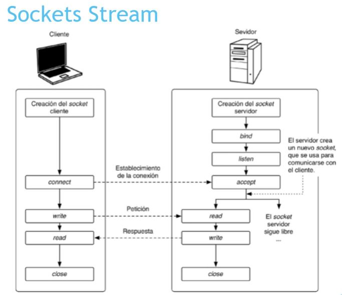
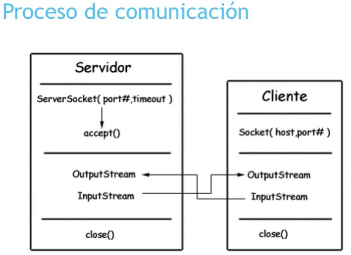
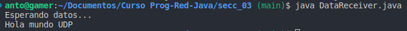
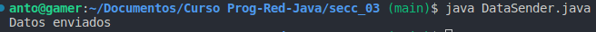

# PROGRAMACIÓN EN RED CON JAVA

## Sección 1: Conceptos básicos de redes
---

#### Conceptos Básicos

**Protocolos de comunicaciones**, conjunto de reglas que permiten la comunicación entre dispoositivos.

| **IP** | **TCP**     | **UDP**      | **PORT**  |
| :----- | :---------- | :----------- | :-------- |
| IPv4   | Orientado a | No orientado | 0 - 65535 |
| IPv6   | la conexión | a conexiones | 0 - 1023  |

* Puertos:
    * 0 - 1023 para programas y protocolos.
    * 1024 - 49151 asignados por ICANN para uso específico.
    * 49152 - 65535 para asignación dinámica o privada.

- UDP:
  - Los mensajes se denominan *datagramas*.
  - Admite 64 kb como máximo.
  - No garantiza que los mensajes lleguen a destino.
  - No se asegura que los mensajes lleguen en el orden correcto.
  - No dispone de detección de errores.

#### Protocolos de Comunicaciones

Las siete capas del modelos **OSI** es útil para dividir un problema en diferentes partes. Donde cada capa de un nivel, se comunica con un nivel adyacente superior o inferior.

> **Física**: define la manera en que los datos se convierten en señales digitales.  
> 
> **Enlace de datos**: define la interfaz con la tarjeta de red.  
> 
> **Red**: permite administrar las direcciones y el enrutamiento.  
> 
> **Transporte**: se encarga en subdividir en *paquetes* y control de errores.  
> 
> **Sesión**: define inicio y fin de las sesiones entre equipos.  
> 
> **Presentación**: define el formato/cifrado de los datos, independiente del sistema.  
> 
> **Aplicación**: son aplicaciones de la interfaz.

El modelo **TCP/IP** o de **Internet** es un derivado del modelo **OSI** pero con cuatro capas.

> **Acceso a Red**: especifica la forma de enrutar los datos. Protocolos de acceso a subredes y hardware asociado. Aquí los datos se llman *trama*.  
> 
> **Internet**: responsable del paquete de datos o *datagrama*. Protocolo *IP*.  
> 
> **Transporte**: datos de enrutamiento y estado de la transmisión. Protocolos *TCP* y el *UDP*. Aquí los datos se llaman *segmento*.  
> 
> **Aplicación**: proporciona aplicaciones de red estándar; Telnet, FTP, HTTP, SMTP, DNS, POP, RLOGIN, SNMTP, etc. Aquí los datos se llaman *mensaje*.  
> 

## Sección 2: Elementos de programación de comunicaciones en red
---

#### Comunicaciones IP y Sockets

En Java el paradigma, será: abrir, leer, escribir y cerrar. En la red, en lugar de un fichero es un Socket.  

##### Direcciones IP y Puertos

Una *dirección IP* es un número que identifica de forma única a cada máquina de la red, y que sirve para comunicarse con ella.

Un *puerto* es un número que identifica a un *socket* dentro de una máquina. Es de 16 bit, desde el 1 hasta el 65535 que sirve para identificar al proceso.

##### Sockets

Mecanismo básico para realizar transferencias de información entre aplicaciones (emisor y receptor) a través de interfaz en una red de datos, permitiendo una abstracción de la pila de protocolos.

Un *identificador de socket* es una pareja formada por una *IP + Puerto*.

Existen distintos tipos de sockets:
1. **Socket Stream**. Usan el protocolo *TCP*. Orientados a la conexión. Permite flujo de datos bidireccional, libre de errores sin duplicar paquetes. Para comunicarse siempre con el mismo receptor, manteniendo el canal de comunicación abierto, hasta que se termina al conexión. Una parte ejerce la función de *cliente* y otra el proceso de *servidor*.
2. **Socket Datagram**. Usan el protocolo *UDP*. Permite flujo de datos bidireccional, pero pueden llegar fuera de secuencia, incluso pueden tener errores. No necesitan mantener una conexión activa, como si es el caso de los anteriores.

#### Librerías de Java

Se utiliza el *paquete* **java.net**. 

Las *clases* disponibles son:
- **Socket**. Implementa un extremo de la conexión TCP.
- **ServerSocket**. Se encarga de implementar el extremo *Servidor* de la conexión en la que se esperarán las conexiones de los clientes.

También se utiliza el *paquete* **java.io**.

Las *clases* de este paquete son:
- **OutputStream**.
- **InputStream**.

## Sección 3: Comunicación cliente/servidor usando datagramas
---

#### Socket UDP

El protocolo **UDP** (User Datagram Protocol), protocolo no orientado a la conexión. El flujo de información es unidireccional entre dispositivos. EL receptor no emitirá una confirmación de la recepción de los datos recibidos. La comunicación es mucho más rápida, ya que no existe *feedback*.

Las características principales son:
* Envío sin conexión.
* No hay control de flujo.
* No hay control de congestión en la red.
* Comunicación más rápida entre dispositivos.

#### DatagramPacket

Las *clases* en Java son: **datagramPacket()** y **datagramSocket()**. Permiten establecer la comunicación y enviar y recibir los paquetes.

Para implementar los *socket* en el servidor:
> 1. Implementar los socket en el servidor.
> import java.net.datagramSocket;
> import java.net.datagramPacket;
> 2. Crear el socket apuntando al puerto por el que comunicaremos DatagramSocket.
> 3. Crear el objeto que nos permitirá transmitir los paquetes (DatagramPaket) 
> A través, de los métodos send() y receive(), enviaremos o recibiremos información del/al cliente.

Para implementar los *socket* en el cliente:
> 1. Implementar los socket en el cliente.
> import java.net.DatagramPacket;
> import java.net.DatagramSocket;
> 2. Crear el socket apuntando al puerto por el que comunicamos (DatagramSocket).
> 3. Crear el objeto que nos permitirá transmitir los paquetes DatagramPacket.
> A través de los métodos send() y receive() enviaremos o recibiremos información del/al cliente.
> ¡Importante! Al crear el objeto DatagramPacket, debe apuntar al servidor y al puerto por el que vamos a comunicar.

Ejemplos de ejecución de los programas *servidor* y *cliente*. Notar que la ejecución es con el comando **java nombreFichero.java** para evitar errores de ejecución:
**Servidor**
  

**Cliente**

## Sección 4: Transmisón de información compleja. Serialización
---

#### Serialización

Es la transmisón de información compleja. Entendiendo por información simple: los enteros, los caracteres y similares.

**Serialización = Objeto + Stream bytes**.   
**Deserialización = Stream bytes + Objeto**.

En Java se debe implementar **ObjectInputStream.readObject**, para la lectura de objetos serializados. Y **ObjectOutputStream.writeObject**, para la escritura de objetos serializados.

## Sección 5: Comunicaciones en red con hilos. Entornos gráficos con la librería Swing
---

#### Aplicación en red con hilos y en entorno gráfico

+ Thread (hilos en la programación en red)
+ Swing (librería gráfica)
+ Comunicaciones red.

Interesa usar hilos, ya que el *Servidor* siempre está escuchando, lo que hace que tenga dedicación exclusiva. Para evitar esto se usan los hilos.
Se crea un hilo paralelo en ejecución por cada cliente que se conecte. Así el *Servidor* que tienes muchos *Clientes* conectados los puede atender, además de realizar otros servicios y funciones.

